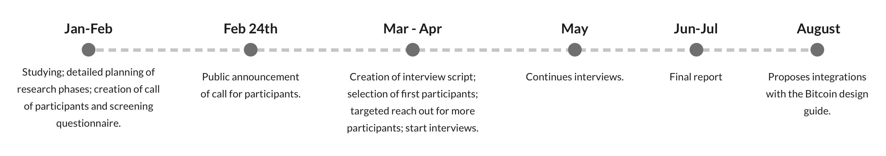

# Introduction

## Author

This research was conducted by Patrícia Estevão, a UX Designer and researcher with interest and experience in Bitcoin and its associated challenges.

## Research grant

This piece was enabled by a research grant offered by [SquareCrypto](https://squarecrypto.org/#grants), with the expectation that the results would be open source and focused on helping the Bitcoin environment as a whole.

## License
This material is licensed under the terms of the [Attribution ShareAlike 4.0 International (CC BY-SA 4.0)](https://creativecommons.org/licenses/by-sa/4.0/).

## Summary

As described in the [proposal document](https://github.com/patestevao/Bitcoin-UX-research-proposal) for this research, the main goal behind this effort is to provide in-depth qualitative knowledge of how people use or perceive Bitcoin. By doing so, we hope that protocol and software development, as well as product conception and design, will be able to empathise with the problems, needs, and goals of Bitcoin users and potential adopters.

To answer the fundamental questions we were aiming for, we resorted to live audio interviews of selected participants from multiple backgrounds and experiences. From these, we gathered enough insights to create an image of who a current Bitcoin user might be. These insights will be presented in the form of quotes, stories, and personas and are intended to bring a more human perspective to future developments in the industry. 

### A privacy note and what to expect from this material

Due to the nature of this subject being potentially sensitive, as it touches both financial and political spheres, the participant's profiles will be kept private. So there won't be a single persona based on a single real person, instead, we'll present a mix and match of relevant aspects to create fictional personas based on real information and real people. More details about this will be brought up in the relevant sections.

## Motivation

Bitcoin is an incredibly innovative and fast-paced technology, which is what one would expect from a global effort of brilliant minds working on the same infrastructure. This is something fascinating for me as a professional but can become a source of distress for me as a user.

It is my belief that working and getting right the very foundations of this technology will be a key factor in the posterior addition of new levels of complexity when building on top of it. This was the prudent path chosen by Bitcoin development so far and I find it only natural that design should follow the same path.

That's why, in a time where so much is happening at a technology level, I chose to take a step back to the very foundations and initial questions we must have answered if we are to design considering people's needs. 

## Timeline

This research was conducted during the period of 6-7 months extending from mid-January 2021 to August 2021.

A rough timeline of the work can be found below:

# Objectives

In one sentence, the objective of this research is to create an illustration of the Bitcoin onboarding journey based on the experience of real users.

To guide us in this mission, we'll use the following broad research questions:

- What are the customer problems behind Bitcoin usage, i.e., what motivated people to use it in the first place?
- What are people’s main goals in their Bitcoin journey?
- What are the main struggles that people find in their Bitcoin journey?

The focus will be both on the abstract user perception of Bitcoin as a technology and how it affects their life, as well as on their practical experience with the interfaces they have to deal with. Everything in this research will be based on the user's perspective, which might not always mirror the factual reality. However, it is in our interest given the context of this project as a design-led effort, to focus on their mental model instead of the absolute technical reality. 

# Resources and Methodology

## UX interviews: what and why

UX interviews or User interviews are a UX research method that consists of a facilitator talking directly to users in 1-on-1 sessions and making them questions about a specific theme. These questions are usually broad and open-ended in a way that the user can have space to share their stories and experiences without feeling constrained.

They are, by nature, a qualitative type of research that focuses on getting detailed insights about users' perceptions of what's asked. Therefore, it is not a method of quiet behavioral observation but instead a way to learn how users see things, their beliefs, their fears, and expectations.

From the above summary, we can point out a few strengths and weaknesses of user interviews.

Strengths:
- Gives the user perspective in a very human way.
- Gives space for users to share their experiences, even beyond the exact questions made.
- Allows for detailed insights, including feelings across an experience.
- Allows for instant adaptation of the script based on the answers (e.g. follow-up questions).
- It's easier to engage users in an extensive set of questions.

Weaknesses:
- Not scalable for many participants or easily generalized for a population set.
- Requires high user engagement, which not everyone will be up to.
- Insights are not necessarily objective - what a user says they will do is not always what they will do.
- The quality of insights will depend on the participant's willingness to engage (e.g. people can get defensive, shy, or uncomfortable to share with a stranger).

Considering the objective of our study concerns this broad comprehension of the user onboarding journey into Bitcoin and how they perceive it in terms of added value and frustrations, the interviews fit as a proper research methodology to achieve this. It also goes well with the intention of not focusing on any single Bitcoin product but rather observing people's relationships with Bitcoin solutions as a whole.

We hope it will serve as a qualitative complement to the already existing quantitative researches on this matter, giving us a much-needed human piece in understanding Bitcoin's impact.

## Internal methodology for the interviews

### Call for participants

In order to advertise and explain the interview process to potential participants, we created a public document with a call for participants that was shared via social media in three different languages: English, Portuguese and Spanish. For a reference of the English version, you can refer [here](https://github.com/patestevao/Bitcoin-UX-interviews/blob/main/call-for-participants.md).
The main goals of this document were:

- To introduce the research theme, its main objective, and the parties involved in it, as well as how to contact the researcher. 
- To introduce how the research would be conducted (interviews) and why this was the chosen methodology.
- To address possible privacy fears by making clear what would be asked of personal information and what mitigation measures were to be taken by the research effort.
- To inform what were the profile requirements for an eligible participant.
- To inform on the step by step process expected for someone who applied, including a link to the next step which was the screening questionnaire.

### Initial screening

Having in mind the limitations of the user interview methodology, namely the inability to interview a very large set of participants, we chose to add a screening process to this research that would allow us to carefully choose who would be interviewed.

The screening consisted of a questionnaire published along with the call for participants that aimed to collect the very basic profile and demographic information needed to inform the choice of interviewees. Some of the most important questions made to determine profiles were:

- In which country the person had experience using Bitcoin.
- The professional area of actuation.
- Broad estimation of when the person first used Bitcoin.
- Frequency estimation of Bitcoin usage.
- Broad description of the main use case they have for Bitcoin.

Based on the resulting answers, we manually chose a set of participants with the most varied background and experience possible in order to bring as much richness as possible to the interviews.

### Conducting the interviews

The interviews were 1-hour audio calls, scheduled previously so that participants could find themselves comfortable and ready to give proper attention to the subject. Even though we had a formal purpose for being there, we tried to avoid having a formal format in the interview so that people would feel more at ease with the number of questions. Essentially, we tried to make it closer to a conversation.

A script was created to help the interviewer cover the main points of interest. However, we took advantage of the on-time flexibility that the interview method allows us and made pertinent changes throughout the calls. Some of the most common changes were:
- Asking in a different order.
- Skipping questions that were already answered in previous questions.
- Developing further subjects of interest that were brought up by the participants.

For reference this was the script that was loosely followed:

#### Perception of social context:

- How would you describe the social context of the place you live in?
- How would you describe people's relationship with Bitcoin or other cryptocurrencies in your circles?

#### Beginning of relationship with Bitcoin:

- How did you first use Bitcoin?
- What do you use Bitcoin for?
- How did you learn about Bitcoin?
- What aspect of Bitcoin interested you most?

#### Feelings surrounding Bitcoin:

- How does it feel using Bitcoin? Are you comfortable, afraid? Is it easy, tiring?
- Is there any part of using Bitcoin that you find the hardest or don't understand?
- Do you feel that you need Bitcoin?
- Do you feel that you could use something other than Bitcoin for the same purpose you use?
- Have you ever had any problems using Bitcoin?

#### Grasping technical knowledge:

- How much would you say that you understand Bitcoin? From the computer science or economic perspective?
- Would you share what types of wallets you use?
- Do you have a personal security protocol to use Bitcoin?
- Are you actively involved with Bitcoin in some way? E.g. work with it, reads a lot about it, participates in any community, etc?

### Interview compensation

When conducting UX interviews, it's common practice to offer compensation in exchange for people's participation. This is done both to show respect and consideration for the person's time, but also to objectively increase the quality of participants in the study. 

Let's take this research as an example, where we asked people for 1 hour of their time and personal information. Had we not offered any compensation, the following probably would have occurred:
- Fewer people would be willing to participate.
- People would only apply if they had a strong personal reason to do so. This could be a positive personal reason (e.g. someone very passionate about Bitcoin), which is not very problematic per se. But could also be a negative one (e.g. someone interested in influencing or jeopardizing the research results), which we want to avoid.

Although we are not completely immune to the risks concerning the "quality" of participants, the offering of financial compensation helps increase the number of people willing to apply and, therefore, dilute the risk in a wider pool of participants.

The value itself and the way the compensation is paid can vary a lot depending on the research subject, the target audience, and the level of time/commitment that will be asked from participants. In our case, the decided value was the equivalent of US$100 paid exclusively through a Bitcoin transaction.

## User personas

User personas will be the culmination of the research work as the main method to transform the insights from the interviews into actionable material for designers, developers, and other creators.

Personas are fictional character descriptions that are used to exemplify and create empathy towards the target audience we want to design for. By the use of these characters, we are able to focus on the characteristics and behaviours that are relevant to our product/subject in a concrete and easy-to-relate manner.

Although it's possible to create personas based on the designer's perception only, they are most reliable when grounded on real user data, which is precisely our proposal here: the insights from the interviews will feed the creation of the personas, which will feed user-centred work and development in Bitcoin.

For further understanding on the theme of user personas, [this article](https://www.interaction-design.org/literature/article/personas-why-and-how-you-should-use-them) is a good starting point.

## Privacy implications and risk mitigations

As Bitcoin touches many spheres of life, it's considered a highly sensitive subject to ask people about. Some of the most important being: personal financial information and personal political views. Therefore, it's something that we, as researchers, should be respectful of when asking a user to share.

However, due to the nature of the user interview methodology, it's expected that a participant will need to share some level of personal information which can be quite specific and detailed. That, along with the delicate research subject we are dealing with, calls for some extra care and considerate thinking from the research team to make people feel more comfortable in their effort to collaborate.

This is a summary of the measures taken on this research to mitigate the privacy risks of the participants:

- Participants were openly presented with the intended purpose of the data collection and were asked if they consented to that usage.
- All information sharing was optional, with the clear message that the user could deny sharing anything they felt uncomfortable with, even after agreeing to the interview.
- Users were not required to share their real name or any sort of documents.
- Interviews were conducted with audio only (unless requested by the participant) to preserve the privacy of their environment.
- No audio from the interviews will be shared or made public.
- The participant's profile and story will be mixed with the others in the creation of our design personas, so we won't present a reflection on any particular individual.

# User Stories

## User bias

Throughout the research, we noticed a participant bias that is worth mentioning and taking into consideration when evaluating the results here presented. 

Although we gathered a pool of participants with quite diverse profiles in terms of background, professional fields, etc., there was something in common with most, if not all, of them: they were people actively interested in helping the improvement of Bitcoin usability. The reasons could be many, from a personal passion for the subject to the interest in seeing Bitcoin go mainstream and increase their investment. 

Even though one of the reasons to offer a participation payment is to try to bring in people with a less personal stake on the subject, the fact that the call for participants asked for an organic sign up to the interviews certainly played a big role in getting more genuinely interested people. This is opposed, for example, to a scenario where an agency is used to recruit people with a certain profile that a company is interested in, which has its different types of biases. In our case, since we were looking for a pool of people that are still part of a niche at the same time that we wanted to reach a global audience, we preferred the usage of our own recruiting methods.

So why does that matter? This doesn't invalidate in the slightest the results that will be presented here, it just requires us to admit that we are looking at people with some tendencies that we won't necessarily find in a more generic or mainstream audience. The most important one being: these tend to be people who go beyond just using wallet software or an exchange platform. Instead, they tend to want to study Bitcoin fundamentals, even if at a superficial level. We cannot say for sure if this is a natural behaviour that comes with the increase of stake someone has in Bitcoin or if this is a characteristic of this particular pool of people. This means that they might not be the best examples of people who understood all they needed from how usable the interface was.

It might just be that we are still in a phase of Bitcoin adoption that most users will be these "actively interested users", in part because they still have to overcome the prejudices and misinformation that is widespread on the subject in order to trust the technology enough to put their money on it. But, once again, it is something to have in mind when designing for the future users we want to reach.

## Demographics

### Interesting facts from the screening process

As stated before, this is not a piece of research focused on statistically relevant quantitative results. However, considering we used an open questionnaire as the screening method for the interviews, it felt like a waste not to comment anything on the overall answers we got. But it's better to face these as not more than interesting facts instead of proper statistic results.

#### Main reason for Bitcoin usage

When asked about the main reason why they used Bitcoin, people were presented with the following options:

- Bitcoin is my work (investor, miner, work in a Bitcoin company, etc).
- I use Bitcoin to send or receive money internationally.
- I use it because I like to try new technologies.
- I protect myself from my country's economic situation.
- I have problems being accepted in the traditional banking system.
- I use it for political reasons.
- Other (please, specify).

If we look at the results from the English questionnaire, even though we had a majority of US answers, there was a good variety in terms of origin/residency from all around the world. In this case, the three winning answers, with quite some proximity between them, were:
24%: I protect myself from my country's economic situation.
21%: Bitcoin is my work (investor, miner, work in a Bitcoin company, etc).
18%: I use it because I like to try new technologies.

Now if we look at the Portuguese questionnaire, we had some Portuguese but mostly Brazilian residents answers. What we observed was an overwhelming majority of people answering the following:
60.7%: I protect myself from my country's economic situation.

There are two interesting conclusions we can draw from this.

The first, which is not completely unexpected, is that in a country where the economic situation is known to be more unstable - both historically and nowadays - we see many more people reaching out to Bitcoin with the use case protecting themselves from a bad economy and weak currency.

The second conclusion is that, even in a pool with more users located in countries with a considered strong economy, the use case of wanting to protect themselves from the current economic situation is still one of the strongest ones. This can mean one of two things, or a combination of both: either the protection against fiat economy is one of the strongest use cases for Bitcoin at the moment, or the people who are interested in Bitcoin tend to be the ones questioning the reliability of the fiat economy. 

#### Frequency of usage 

When asked about the frequency with which they used Bitcoin, users have been presented with the following options:

- Multiple times a week
- Multiple times a month
- Once a month
- Once every few months
- Even less than the above options

Again, we see an interesting discrepancy between results in English and Portuguese. While in English we had 58.1% of participants answering that they use Bitcoin at least multiple times a month – i.e. the sum of the first two answers – in Portuguese this number was only 31.6%. The most common answer for the Portuguese questionnaire was "once a month", with 45.6%. So, even though we are still talking about active users, they are not as active as English speakers.

This can have multiple explanations, but a couple of educated guesses could be:

- This Portuguese-speaking audience uses Bitcoin more as a savings account, so they don't need to move money very frequently.
- The reached English-speaking audience was comprised of more users involved with the technology, so they have more reasons to transact.

However, this is not the most interesting aspect of this data as we can only make vague assumptions about it. What's useful to note is that, overall, the vast majority of participants stated that they are active users, with a relevant usage frequency. This information can help guide future wallet features and better define user priorities.

### Interviewees

In total, we interviewed 21 participants from multiple locations around the world. According to the answers from the screening questionnaire, their demographic profile varied in the following:

#### Origin or country of residence

This refers to the location where this user has had the most experience using Bitcoin and has some understanding of the social context, be it their country of origin or not. The countries reached were: 
- Australia
- Brazil: 3 participants 
- Germany
- Greece
- Israel
- Italy
- Kenya
- Mexico
- Nigeria
- Philippines
- Portugal
- Romania
- Spain
- Syria
- United Kingdom
- USA: 3 participants
- Venezuela

**World map with participants' countries**

For better contextualization, we've gathered some basic information about each of these countries. All of the data comes from Wikipedia and this research is merely reproducing without questioning any of them.

##### Australia

**Population:** 25,837,549

**GDP per capita (IMF estimations from 2021):** US$ 62,723 – 15th in the world

**Neighbouring countries:** no land borders. Sea borders with Papua New Guinea, Indonesia, East Timor, The Solomon Islands, Vanuatu, New Zealand

**Official currency:** Australian dollar

**Currency exchange rate to 1 US dollar:** 1.360861

**Inflation rate:** 0.7% (2020 estimate)

**External debt relative to GDP:** 130% of GDP 

##### Brazil

**Population:** 213,459,366

**GDP per capita (IMF estimations from 2021):** US$ 7,011 – 104th in the world

**Neighbouring countries:** Argentina, Uruguay, Paraguay, Bolivia, Peru, Colombia, Venezuela, Guyana, Suriname, French Guiana

**Official currency:** Real

**Currency exchange rate to 1 US dollar:** 5.169541

**Inflation rate:** 4.52% (2020 estimate)

**External debt relative to GDP:** 38% of GDP

##### Germany

**Population:** 83,121,363

**GDP per capita (IMF estimations from 2021):** US$ 51,860 – 24th in the world

**Neighbouring countries:** Netherlands, Belgium, France, Switzerland, Poland, Austria, Czech Republic, Denmark

**Official currency:** Euro

**Currency exchange rate to 1 US dollar:** 0.845764

**Inflation rate:** 0.5% (2020 estimate)

**External debt relative to GDP:** 165% of GDP

##### Greece

**Population:** 10,718,565

**GDP per capita (IMF estimations from 2021):** US$ 19,673 – 59th in the world

**Neighbouring countries:** North Macedonia, Albania, Turkey, Bulgaria

**Official currency:** Euro

**Currency exchange rate to 1 US dollar:** 0.845764

**Inflation rate:** 1.1% (2017 estimate)

**External debt relative to GDP:** 298% of GDP

##### Israel

**Population:** 9,376,994

**GDP per capita (IMF estimations from 2021):** US$ 47,602 – 27th in the world  

**Neighbouring countries:** Palestine, Jordan, Lebanon, Syria, Egypt

**Official currency:** New shekel

**Currency exchange rate to 1 US dollar:** 3.246915

**Inflation rate:** 0.3% (2019 estimate)

**External debt relative to GDP:** 33% of GDP

##### Italy

**Population:** 59,169,131

**GDP per capita (IMF estimations from 2021):** US$ 34,997 – 36th in the world  

**Neighbouring countries:** Switzerland, France, Slovenia, Austria, San Marino

**Official currency:** Euro

**Currency exchange rate to 1 US dollar:** 0.845764

**Inflation rate:** 1.3% (2017 estimate)

**External debt relative to GDP:** 141% of GDP

##### Kenya

**Population:** 47,564,296

**GDP per capita (IMF estimations from 2021):** US$ 2,129 – 165th in the world  

**Neighbouring countries:** Somalia, Ethiopia, Uganda, Tanzania, Sudan

**Official currency:** Kenyan shilling

**Currency exchange rate to 1 US dollar:** 108.60

**Inflation rate:** 8% (2017 estimate)

**External debt relative to GDP:** 26% of GDP

##### Mexico

**Population:** 126,014,024

**GDP per capita (IMF estimations from 2021):** US$ 9,246 – 90th in the world  

**Neighbouring countries:** USA, Guatemala, Belize

**Official currency:** Mexican peso

**Currency exchange rate to 1 US dollar:** 19.950098

**Inflation rate:** 3.15% (2020 estimate)

**External debt relative to GDP:** 43% of GDP

##### Nigeria

**Population:** 211,401,000

**GDP per capita (IMF estimations from 2021):** US$ 2,432 – 160th in the world  

**Neighbouring countries:** Cameroon, Niger, Benin, Chad

**Official currency:** Naira

**Currency exchange rate to 1 US dollar:** 411.50

**Inflation rate:** 16.5% (2017 estimate)

**External debt relative to GDP:** 2% of GDP

##### Philippines

**Population:** 110,543,395

**GDP per capita (IMF estimations from 2021):** US$ 3,646 – 141st in the world 

**Neighbouring countries:** no land borders. Sea borders with China, Japan, Indonesia, Malaysia, Palau, Taiwan, Vietnam.

**Official currency:** Philippine peso

**Currency exchange rate to 1 US dollar:** 50.373322

**Inflation rate:** 3.2% (2017 estimate)

**External debt relative to GDP:** 27% of GDP

##### Portugal

**Population:** 10,298,252

**GDP per capita (IMF estimations from 2021):** US$ 25,065 – 53rd in the world 

**Neighbouring countries:** Spain

**Official currency:** Euro

**Currency exchange rate to 1 US dollar:** 0.845764

**Inflation rate:** 1.6% (2017 estimate)

**External debt relative to GDP:** 203% of GDP

##### Romania

**Population:** 19,317,984

**GDP per capita (IMF estimations from 2021):** US$ 14,968 – 73rd in the world 

**Neighbouring countries:** Moldova, Bulgaria, Serbia, Hungary, Ukraine

**Official currency:** Romanian leu

**Currency exchange rate to 1 US dollar:** 4.160154

**Inflation rate:** 3.8% (2019 estimate)

**External debt relative to GDP:** 58% of GDP

##### Spain

**Population:** 47,394,223

**GDP per capita (IMF estimations from 2021):** US$ 30,996 – 43rd in the world 

**Neighbouring countries:** Portugal, France, Andorra

**Official currency:** Euro

**Currency exchange rate to 1 US dollar:** 0.845764

**Inflation rate:** –0.5% (2020 estimate)

**External debt relative to GDP:** 170% of GDP

##### Syria

**Population:** 18,276,000

**GDP per capita (IMF estimations from 2021):** US$ 2,807 – 152nd in the world 

**Neighbouring countries:** Iraq, Turkey, Jordan, Lebanon, Israel

**Official currency:** Syrian pound

**Currency exchange rate to 1 US dollar:** 1,257.8616

**Inflation rate:** 25.5% (2017 estimate)

**External debt relative to GDP:** 24% of GDP

##### United Kingdom

**Population:** 67,081,234

**GDP per capita (IMF estimations from 2021):** US$ 46,344 – 29th in the world 

**Neighbouring countries:** Ireland

**Official currency:** Pound Sterling

**Currency exchange rate to 1 US dollar:** 0.720281

**Inflation rate:** 1.8% (2019 estimate)

**External debt relative to GDP:** 345% of GDP

##### United States

**Population:** 332,085,405

**GDP per capita (IMF estimations from 2021):** US$ 68,309 – 10th in the world 

**Neighbouring countries:** Mexico, Canada

**Official currency:** United States dollar

**Currency exchange rate to 1 US dollar:** 1

**Inflation rate:** 5.4% (June 2021)

**External debt relative to GDP:** 102% of GDP

##### Venezuela

**Population:** 28,705,000

**GDP per capita (IMF estimations from 2021):** US$ 1,542 – 176th in the world 

**Neighbouring countries:** Brazil, Guyana, Colombia

**Official currency:** Bolivar Soberano

**Currency exchange rate to 1 US dollar:** 398,490,124,779.549683

**Inflation rate:** 2,100% (2021 IMF estimate)

**External debt relative to GDP:** 23% of GDP

**Sources for the country data:**
[Population](https://en.wikipedia.org/wiki/List_of_countries_and_dependencies_by_population)
[GDP per capita](https://en.wikipedia.org/wiki/List_of_countries_by_GDP_(nominal)_per_capita)
[Inflation rate](https://en.wikipedia.org/wiki/List_of_countries_by_inflation_rate)
[External debt](https://en.wikipedia.org/wiki/List_of_countries_by_external_debt)
[Currencies exchange rates – July 28th, 2021](https://www.x-rates.com/table/?from=USD&amount=1)

#### Work profile

This refers to their broad professional actuation area.
- STEM (science, technology, engineering, and mathematics): 7 participants
- Media and communications: 2 participants
- Law and human studies: 1 participant
- Government or military: 2 participants
- Business: 3 participants
- Art and design: 5 participants

#### First Bitcoin usage

This refers to the broad period when the person used Bitcoin for the first time, which doesn't necessarily correspond to the first time they heard about Bitcoin.
- Before 2017: 5 participants
- Between 2017 and 2020: 10 participants
- After 2020: 4 participants
- Never used: 1 participant *

* Even though the proposal was to only interview people who had already used Bitcoin at least once, there was one exception of an interesting profile we happened to come by and decided to incorporate into the research. This was someone familiar with Bitcoin, had a wallet installed, had a backup, had received a small transaction, but didn't feel had enough incentives to overcome the usability challenges they found. As such, it was deemed as an opportunity to further enrich the research insights.

#### Frequency of usage

This refers to the overall frequency of Bitcoin transactions, be it sending or receiving, the participant usually engages in:

- Multiple times a week: 3 participants
- Multiple times a month: 6 participants
- Once a month: 5 participants
- Once every few months: 5 participants
- Even less than the above options: 1 participant

#### Main Bitcoin use case

This refers to the user's primary reason, broadly speaking, for starting to use Bitcoin, even if other use cases co-exist nowadays:

- Bitcoin is my work (investor, miner, work in a Bitcoin company, etc): 4 participants
- I use Bitcoin to send or receive money internationally: 2 participants
- I use it because I like to try new technologies: 1 participant
- I protect myself from my country's economic situation: 9 participants
- I use it for political reasons: 2 participant
- None of the above

## User personas

Given the results from the user interviews, we've gathered and combined the most interesting insights into 5 personas of current Bitcoin users. Making it 5 allowed us to reflect a variety of profiles and user roles without creating such a large number that would dissipate too much content and lose its value for a designer or other interested professional.

Each persona is completely fictional in the sense that it is formed by insights from multiple users, so there's no one real person that matches these profiles.

As the personas have their profile and stories, we used mostly coherent characteristics that would make it plausible to see them as real people. Although we managed to place most of the desired insights into a persona, any relevant information that was left out is shared throughout this report in other sections.

### Musa

***The one for whom Bitcoin fits right in.***

#### Country 
Nigeria

#### Age 
22

#### Occupation 
Product development at a local startup.

#### Frequency of usage (medium-high)

Is always moving money in and out of Bitcoin in order to live.

#### Conscious importance given to Bitcoin being decentralized (high)

Perceives is as seeing the opposite of his local reality of a weak centralized currency. 

#### Conscious importance given to Bitcoin being censorship-resistant (medium-high)

Wants to be independent of government and banks restrictions.

#### Conscious importance given to physical security and privacy (high)

He has a risk of being harassed by police or other security guards that can demand to see his phone and transfer money. Because of this, he puts high value in wallets with the feature of hiding themselves in the app list.

#### Conscious importance given to digital security and privacy (low)

Doesn't see any problems in using custodial wallets.

#### How they describe their use case

The main use case for Bitcoin is as a store of value, given that the local currency can't be trusted. But also takes it as a long-term investment as he expects it to increase value with wider adoption. "I expect to be an early-adopter in the future"

#### Quote

> "The perception that Bitcoin is too technical to use can be misleading and scare people away unnecessarily."

#### Musa's story

Musa didn't need to be a cypherpunk or libertarian to understand Bitcoin's value because his daily life in Nigeria has taught him, in practice, not to trust central banking or the government. His reality is of a local fiat currency with a constantly plummeting value and a population who lives with very low incomes on an international level.

Nevertheless, he says the country's youth is quite tech-savvy and welcoming of new technologies that can make their lives better. So he sees a bright future for Bitcoin in Nigeria. He believes that people don't need to learn all technical aspects of Bitcoin, they just need to see the value that it can offer.

Musa himself learned about Bitcoin on internet forums and started using it around 1 year ago. He only goes from fiat to Bitcoin through P2P to avoid the banking restrictions on cryptocurrencies. He has learned by himself everything that he needed to trust and use Bitcoin. It was a process, of course, but it didn't feel so scary or complex because his interest and curiosity led him through the challenges.

His overall relationship with Bitcoin is quite positive in the sense that, rather than being anxious about being his own bank, he finds the responsibility empowering and an opportunity for independence.

He uses any cryptocurrency that will serve a purpose for him, be it for a short-term investment, local liquidity, etc. But he considers Bitcoin the most solid one at the moment and that's where he keeps his savings.

#### How was their experience so far

His initial approach was quite interesting: in order to learn, he did a deep-dive week on which he tried using multiple wallets and doing multiple operations until the operational aspects were clear for him. After that, he didn't have to worry about not knowing what to do.

Finding P2P peers to transact with is usually not a problem. Even though is not widespread, there's a relatively established crypto interest among the population, so Bitcoin is quite liquid in practice. He even saw some random people on the market with crypto apps on their phones, which was a nice surprise.

For his storage, he uses custodial wallets, usually from big exchanges. So from his perspective, holding bitcoins is quite straightforward and he doesn't have any experience with running nodes or more complex backup setups, such as multi-sigs.

His greatest complaint is about fees fluctuation, which he says can be quite problematic for low-income people. This is especially true in places such as Nigeria where the local currency is very devalued against the dollar, so the fees variation can hurt a lot more. 

A second complaint is that Bitcoin is not very human, in his opinion. All important pieces seem made for machines (addresses, hashes, etc), so it can be scary to face a wallet if you are a new user.

#### Their Bitcoin onboarding user journey

#### Specific frictions and usability pain points encountered
- Lack of understanding of custodial risks.
- Fluctuation in fees that reflect quite strongly in his local currency and purchasing power.
- Machine-focused elements, such as addresses and hashes.

#### Feelings and keywords
curiosity, empowerment, challenging, useful.

### Peter

***The all-in investor.***

#### Country 
United Kingdom

#### Age 
52

#### Occupation 
Civil servant

#### Frequency of usage (medium-low)

He doesn't transact much nowadays, mostly to revert profits to fiat.

#### Conscious importance given to Bitcoin being decentralized (medium-high)

He knows that Bitcoin is a better store of value than fiat only because there isn't a central government behind it.

#### Conscious importance given to Bitcoin being censorship-resistant (medium)

He actively finds it interesting, but probably wouldn't affect his usage.

#### Conscious importance given to physical security and privacy (medium)

Just basic opsec of not announcing that he has a significant Bitcoin investment.

#### Conscious importance given to digital security and privacy (high)

He pays a service to help him especially with this.

#### How they describe their use case

He was mainly interested in a rentable medium/long-term investment, nothing like trading or other types of investment that you need to transform into a job by itself. Particularly after his economic studies that came with the Bitcoin investment, he started valuing it as a store of value against the constant fiat money devaluation.

#### Quote

> "Uncertainty is something you definitely want to avoid when it comes to money"

#### Peter's story

Peter was looking for a decent medium/long-term investment a few years ago, something for him to maintain, and hopefully increase a bit, his savings. And, even though he had access to everything in the traditional financial market, he was utterly disappointed with what it had to offer. Still, he didn't want to sit down and wait for his purchasing power to go away with inflation.

Around 2015, he heard about Bitcoin on an online news website, researched about it, and decided it might just be the investment he was looking for. He started with some purchases to try it out and, after one year, all his investments were in Bitcoin and nothing else. Not even other cryptocurrencies interested him.

To trust it so much as an investment, Peter studied and has learned pretty well the essential aspects of Bitcoin, both from an economic and computer science perspective. "I just don't code, but other than that, I took the time to educate myself about where my money was."

He has always used traditional Bitcoin exchanges with all the necessary KYC. To make use of any of his profits, he converts it back to fiat first. This year, he even bought a house with his Bitcoin earnings.

He identifies himself with the ethos of an uncensorable means of transacting, but wouldn't be comfortable with going illegal if Bitcoin got banned, so he worries about how governments will regulate it.

#### How was their experience so far

The first experiences with Bitcoin were a bit stressful for him. The biggest learning curve was the exchange interface, the wallet operational part wasn't so much of a problem after you get used to addresses. However, the idea of having to keep his backup very secure was intimidating and something that he has always worried about. 

Nowadays, he uses a relatively expensive service that helps him secure his keys in a multi-sig setup where he doesn't have to trust them with control over the money. Although he wouldn't use a custodial service, he values reducing the burden of taking care of his keys all by himself. The thought that a single mistake on his part could lead to the loss of all his investments can be quite scary and the weight of this increases with the amount he owns.

Although he understands the reason, he still doesn't feel comfortable with the uncertainty of confirmation times. Especially given that you need to wait for 6 confirmations for the transaction to even be acknowledged on some platforms. "Uncertainty is something you definitely want to avoid when it comes to money."

#### Their Bitcoin onboarding user journey

#### Specific frictions and usability pain points encountered
- Complexity on crypto exchanges interfaces.
- Uncertain confirmation time, in addition to platforms that wait for multiple confirmations to acknowledge the transaction.
- Pressure into knowing how to keep your backup safe.

#### Feelings and keywords 
intimidating, stressful, discovery, learning, trust, solid.

### Ilse

***The Bitcoin nerd.***

#### Country 
Germany

#### Age 
19

#### Occupation 
Software developer

#### Frequency of usage (high)

Now she uses it as part of her work and to receive regular payments.

#### Conscious importance given to Bitcoin being decentralized (high)

Gives it a high personal value, even if she doesn't feel much of the practical need for it.

#### Conscious importance given to Bitcoin being censorship-resistant (high)

Gives it a high personal value, even if she doesn't feel much of the practical need for it.

#### Conscious importance given to physical security and privacy (low)

She lives in a safe environment and is not high-profile enough to be an individual target herself.

#### Conscious importance given to digital security and privacy (medium-high)

Uses a hardware wallet and a redundant backup setup.

#### How they describe their use case

It started political since this was the reason she got interested in it in the first place. But, as it developed into her profession, her use case evolved into work and receiving international payments for her compensation. An interesting addition to her particular use case was the fact that she started using as an underage before she could be accepted into the traditional fiat system.
More recently, she took up the role of a merchant as well with her online store side business. 

#### Quote

> "Even for me – a technical user – Bitcoin felt like executing nuclear code."

#### Ilse's story

Ilse's Bitcoin journey started when she was still at school. At 16, she learned about it on online forums and was instantly intrigued by the proposed ethos of the project of being censorship-resistant and independent from government and central banks. "I know I speak from a relatively free country, but these are freedoms I don't think should depend on the benevolence of a given government."

As she was already a programmer in her free time, she dove deep into the theoretical and technical knowledge about the technology, much before she made her first transaction on the mainnet to test it out. When she started using it, she was amazed at how simple it was to be "accepted" into the ecosystem. "As an underage, it was much easier to have access to money with Bitcoin than it was with a bank".
As soon as she finished school, she started working as a remote intern at a Bitcoin startup and getting her internship compensation was pretty seamless with Bitcoin.  

In the last few months, she set up an online shop in partnership with a friend of hers who crafts Bitcoin-themed accessories, as a side business for both. She's using a BTC pay server and accepting Lightning payments. In this case, Bitcoin has been essential to facilitate international purchases. Setting up the server and the technical part has been pretty straightforward, she thinks that even non-technical people could do it with some basic learning. "Taking care of packages and transport is the most difficult part."

On her social group, she's the Bitcoin person who tries to evangelize it to everyone. But she believes that her generation will only adopt Bitcoin with modern and cool interfaces, and good UX.

#### How was their experience so far

Since she learned how to use Bitcoin before learning how to deal with banks, she found banks much more complicated.

Her overall experience as a user has been pretty smooth, especially because she studied the inner workings of the technology before using it.

But it wasn't all roses the whole time. "Even for me – a technical user – Bitcoin felt like executing nuclear code". This was her take on how heavy it felt the responsibility of dealing with money through code and being able to lose it forever if done wrong. And added that, with Bitcoin, she learns new things every day.

She has also gone through the known experience of accidentally paying a 20$ fee in a transaction to pay for a coffee cup, during a fee surge period. The casual mindset she was in, plus the lack of any warnings from the wallet interface, were the perfect recipe for the most expensive coffee she ever had. "wallets could give some kind of warnings about fees that don't seem to make sense, or even ask you if you want to wait until the fees are lower if it's not an urgent transaction."

Apart from that accident, she doesn't have giant complaints. But she noticed that displaying past addresses is something that is not always easy – or possible – from an interface. The exploration of the transaction history list is overall too simplistic sometimes and lacking better search features. "There should be better ways to track transaction history, it's especially important for merchants."

#### Their Bitcoin onboarding user journey

#### Specific frictions and usability pain points encountered
- Irreversibility of operations, especially from a programmer/command line point of view.
- Lack of wallet intelligence regarding automatic fees.
- Lack of better ways to track transaction history.

#### Feelings and keywords 
passion, ideology, study, work

### Hugo

***The one who started using without understanding it first.***

#### Country 
Brazil

#### Age 
38

#### Occupation 
writer for an international Bitcoin magazine

#### Frequency of usage (high)

Gets weekly pays for his work.

#### Conscious importance given to Bitcoin being decentralized (high)

Doesn't trust the government or its currency, so sees Bitcoin as insurance from it.

#### Conscious importance given to Bitcoin being censorship-resistant (medium)

Worries about the power of banks to decide what transactions are allowed or not.

#### Conscious importance given to physical security and privacy (medium-high)

The fear of violent targeted attacks makes him extra discrete and careful when dealing with strangers and Bitcoin.

#### Conscious importance given to digital security and privacy (medium)

Makes an effort to have an offline wallet, but doesn't have the budget or technical knowledge to go more sophisticated.

#### How they describe their use case

His main need – the one who brought him to Bitcoin in the first place – is for easy international payments. This is how he gets paid when he writes articles for international magazines. But he also values a lot the feeling of being more private from government eyes and from the banks which are given almost a "police power" to define what's suspicious or not. Nowadays, he treats it as insurance from many failures of the fiat system.

#### Quote

> "I believed the anti-Bitcoin argument that Bitcoin couldn't have value because it was not backed by anything until I found out that our fiat money isn't either."

#### Hugo's story

Hugo didn't have to be convinced about the problems of having a fiat currency under the control of his government. His parents were victims of a serious financial crisis that happened in Brazil a few decades ago, which ended with the government confiscating people's savings. And, even today, he faces daily political turmoil in the country which has a direct effect on the economy and the currency value.

Nevertheless, he didn't start as a political user. His relationship with Bitcoin started quite suddenly when he found himself being paid in Bitcoin for his work as a writer. So he didn't have time to learn any important concepts or even get a full idea of how to use it before getting his first payment.

Even though he's not a technical expert, he says it was essential for him to understand mining to understand the value of Bitcoin. He also tries to be up-to-date with the innovations in order to learn what features are useful for him.

He only tries to advocate it to his family and close relationships. For everyone else, he's very careful in mentioning Bitcoin and likes to be discrete regarding his savings for fear of being subject to violent targeted attacks. "This is Brazil, we had one of the first Bitcoin kidnaps that we know of." This fear of violence is also what usually keeps him away from using P2P services, as he already heard stories of scamming and mugging when transacting directly with strangers. Instead, he prefers to use local exchanges and solutions of "easy exchanging" that take advantage of local financial services that are specific to Brazil.

He believes that Bitcoin should be used more as a currency, in opposition to the "hodlr" mindset. However, he's afraid of spending at the "wrong time" given the price variation.

Another belief of his is that a blockchain-based solution could help reduce the issues of political corruption and increase government transparency.
As for the local adoption, he perceives a common negative association between Bitcoin and the countless scams that used its name and which tricked many people in their desperate attempt to "make money". But he also believes, that, once they understand it, they'll not be so resistant. "It's a people with low education in average but used to changes and improvisation to survive."

#### How was their experience so far

Even though his experience started with the pressure of already having his pay-check on a wallet, getting a grasp of the basic wallet operations wasn't so much of a problem. There was a learning period, but it wasn't a traumatic one. Certainly much easier than going through the necessary trouble that it is, both in complexity and taxes, to make an international transaction with fiat in Brazil.

One thing that left a mark on him was the wallet setup process, which feels like a very tense operation. "There are so many warnings." The journey as a whole felt discouraging because of the fear it causes. Considering it was the first interaction with a wallet, he believes it should be the exact opposite.

Another tense moment for him is the wait for transaction confirmation. He assumes that, even though he currently values Bitcoin much more, he can't help but miss the feeling of support that he has with a bank. 

But, in general, he already feels very comfortable with Bitcoin and keeping his savings in it. Having a sophisticated set up or even a full node is something he believes is too much for his current budget or technical knowledge, so he keeps his money in a regular mobile wallet on an offline device.

As for spending, he only used Bitcoin directly for very specific purchases, such as an online VPN. For everything else, he still needs to go through converting into the fiat system first.

#### Their Bitcoin onboarding user journey

#### Specific frictions and usability pain points encountered
- Complex and unfriendly wallet set up.
- High or unpredictable confirmation times.
- Lacks the feeling of support from centralized institutions.

#### Feelings and keywords stability, insurance, fear, tension.

### Emma

***The one who lacks a compelling use-case.***

#### Country 
USA

#### Age 
29

#### Occupation 
Reporter on a local news

#### Frequency of usage (low)

She started using it because a friend has sent her a bit. But she hasn't done much with it until now.

#### Conscious importance given to Bitcoin being decentralized (low)

Finds it an interesting concept, but doesn't have a problem with her local fiat currency (US dollar).

#### Conscious importance given to Bitcoin being censorship-resistant (none)

She doesn't seem to have complaints about the fiat system. 

#### Conscious importance given to physical security and privacy (low)

Especially given the values she has dealt with in Bitcoin, she didn't even think about this. So her worry will be the same as having her phone stolen.

#### Conscious importance given to digital security and privacy (some)

Recognizes the dangers of being hacked, but thinks that the best solution is to have a centralized institution to help her with that.

#### How they describe their use case

She doesn't feel like there's a use case for her right now. But she might use it if more online merchants accepted it, especially for international transactions which she sees as one of the strong points of Bitcoin.

#### Quote

> "I agree that banks and credit cards are cumbersome to start with, but they give you support in exchange for that."

#### Emma's story

Emma is your typical "I have a friend who talks about Bitcoin all the time" person. And, as a true advocate, this friend tried explaining some basic Bitcoin concepts and helped her set up a wallet a couple of years ago. But, despite the efforts, she had a hard time understanding the purpose of it or finding a reason that would make it worth the trouble that it seemed to be.

"It sounded like gift cards or something that I can already achieve with my credit card."
The truth is that she already has enough financial conveniences with the traditional system, so it doesn't seem practical to learn about a whole new system.

The hardest part for her was to trust something led by unknown people on the internet. What guarantee did she have that it wouldn't all disappear from one day to the other? Besides, the fact that the value fluctuated a lot and that it felt very intangible also made her very skeptical of it.

But it isn't a lost affair. The skepticism is starting to fade as she sees that Bitcoin is going more mainstream, the market seems more mature and established, and the fact that the value has risen a lot also increased her confidence in it.

#### How was their experience so far

Her experience is limited to the "bitcoin sessions" she had with her friend, so 

She found the wallet app relatively easy to navigate through. Sending and receiving transactions doesn't seem like something difficult. She even mentioned that is cool to be able to label your transactions to help with your organization later on. The real problem for her is the transition between fiat and Bitcoin. "I currently have no idea how to transform my dollars into Bitcoin, sounds like something the wallet would do as well."

Her friend helped her set up the whole wallet, which meant direct guidance on doing an offline backup by writing the seed on a piece of paper. She still has the seed, but she also doesn't know what she'd need to do to recover the wallet if needed. "Given all the steps I remember from the backup process, I imagine the recovery will be something at least as complicated as that."

#### Their Bitcoin onboarding user journey

#### Specific frictions and usability pain points encountered
- Trusting a decentralized system.
- Finding a use case given her inclusion in the fiat system.
- Not having the support feeling that a centralized institution gives her.
- Making the transition between fiat and Bitcoin.
- Perceived complexity of the backup and recovery processes.

#### Feelings and keywords skepticism, cumbersome, unpractical.

## How to interpret and use the personas

Although the content is open source and free to be interpreted in one's preferred manner, we'd like to leave suggestions and explanations that we think can be useful when considering them to think about Bitcoin products and solutions.

### What they're not

There are three important disclaimers to be made about the personas for the best understanding of their value.

The first is that they are not a representation of a whole country. All of the aforementioned places have multiple people with very different backgrounds and realities, so it makes no sense to see the personas as a generalization of that country's population. Instead, they are to be seen as a profile of someone who could live in that country and have that reality.

The second disclaimer is that those personas do not represent all current Bitcoin users. As a limited set of participants was interviewed, only a limited set of experiences was compiled. Even though we expect that some of these experiences will be shared among many users – as some were shared even among the small set of interviewees – they are certainly not the exhaustive picture of people who currently use Bitcoin.

Finally, a disclaimer that can seem quite obvious, but it's fundamental for the correct mindset when creating for Bitcoin: those personas should not limit the people we want to reach with Bitcoin. The fact that these users were already successfully reached and found a use for Bitcoin – for most personas – does not mean that audiences beyond current users should be forgotten. 
Hopefully, by understanding what led to "success stories" for Bitcoin usage and what were the problems they faced, we'll also be able to rethink solutions and help the onboarding of previously unreached people.

### Using them on a solution

A few tips for using a persona if you never did it before.

There's a reason why they are made to seem like real people. The idea is that you create empathy for them and this will help you have their needs and their best interest in mind when creating a solution. Having people in the centre of your thoughts is a great first step to build something usable.

Try to imagine one of these people going about their business and how the solution you are thinking of could benefit them. 
- Do they already seem to have a problem that you're trying to fix? 
- Would their experience be improved if they learned about what you are creating? 
- Does the way you are envisioning things fit the way they use to do things? 
- How would one of them use your creation step by step? Can you identify possible difficulties they will have along the way?

This rather simple exercise will help you uncover possible opportunities or points of improvement that you could work on.

## Quotes and impressions

Although not every piece of content from the interviews needs to be reflected in this report, there are some interesting quotes and observations that we thought deserved some space. Some of them just didn't fit any persona for a cohesive profile, others show similarities between experiences even among the limited set of interviewees. 

They are not to be taken as absolute truths but, hopefully, as helpful perceptions that people might have of the Bitcoin experience.

> "Fear of BTC is like fear from the internet in its beginnings."
A user on why people are afraid of using Bitcoin and why they will possibly get used to it once it's part of their daily lives, as it was with the e-mail and the internet as a whole.

> "Widespread adoption needs to be cultural, the trust needs to comes from close people in your community. People need to feel related to others who use BTC."
A user on why 'community evangelization' is much more powerful than trying to force education or a vision about a subject from a faraway centralized source.

> "Staring with Bitcoin is a journey of discovery. It can be both fun or scary."
A user on how the challenges of getting into Bitcoin can be perceived differently depending on the user's feelings and approach to it.

> "I don't want to be a liability to myself."
A user talking about their attitude and motivation for learning how to use Bitcoin and why the challenges needed to be faced heads on, without viewing them as a problem.

> "As a user, I want to know what I need to do and perceive the value being offered."
A user on why they don't feel the need to learn all technical aspects of Bitcoin and why they think widespread adoption will take this path of focusing more on the practical benefits than on the knowledge of how the technology works.

> "Writing it down felt clandestine".
User, with a humorous tone, talking about their experience writing down their seed back up. Especially given the alerts and recommendations that usually accompany this process.

- Most users had experience – and some still have – with either manually typing addresses or copying and verifying all digits one by one. It's one of the most cumbersome tasks pointed out. The ones who do this are usually not highly technical users and are not aware of the address checksum validation.

- Most users find that Bitcoin usability has improved over time. But, unless they already use Bitcoin for 5 or more years and have experienced some significant usability developments on the protocol level, this improvement seems more connected to them getting used to the Bitcoin routines and steps. In this case, the discomfort of using it disappears (or is drastically reduced). The reason for saying this is that, when showing their routine to other people, it will likely be received with confusion or skepticism. So it suggests that it is more a matter of learning than of Bitcoin usability as a whole having improved drastically over time.

- Most interviewed users who had a relevant stake in Bitcoin were interested and went on personal study journeys to learn about the technology, its advancements, its challenges, its economic foundations, etc. It can be seen as a necessary step for them to further trust the system they are putting their money into. But also a way to better understand the best features and practices that can help them be more secure and feel more comfortable dealing with higher amounts of money. Interestingly enough, some of these users still advocate that technical knowledge is not needed to start using Bitcoin. So, from observing their experience, there's probably a moment where this interest should naturally come in when someone wants to deepen their financial commitment.

- Most users first heard about Bitcoin on the internet in opposition to hearing it from a personal relationship. This can partially be explained by the fact that current users are still relatively early adopters, so it's not common to have a social circle where Bitcoin is a common topic.

- A common usability issue between users is to, at some point, have unconsciously sent a transaction with a very high fee. We have no evidence of how Lightning Network might be impacting this in practice. But the stories seem to be mostly of times where Bitcoin cafes and other low-value merchants had no option unless settling transactions on-chain.

- Most users who are open to using other cryptocurrencies perceive Bitcoin as the current standard for a strong and trustworthy store of value. The others are for ephemerous uses such as short-term trading or a special liquidity situation.

- A very frequent source of anxiety, even when the technical reason is understood, is the uncertainty related to Bitcoin confirmation times.

- Both from some participants' perspectives and from what they observed in their communities, the increase in value has also increased the impression of trustworthiness they have of Bitcoin.

- None of the users feel they can use Bitcoin for daily expenses in a significant way. Consequently, the transition between Bitcoin and fiat is an inherent extra step of their journey if they want to make use of the money.

- Some users are completely excluded from international finance due to their country's political and economic context and Bitcoin has proven to be a viable way for them to transact internationally. In the cases we interviewed, the use case was to be paid for work they performed for international companies, be it a wage or a freelance payment. Nevertheless, they don't consider it a solution that is commonly used by other people in their countries and is not a risk-free path for them personally.

# Recommendations

This section goes beyond the research results themselves and adds some of the researcher's thoughts on opportunities unveiled by the interviews. We won't go into many details since our goal is to inspire solutions and not decide them.

## The fiat to crypto transition

It seems inevitable at this point that, for many users, the transition between fiat and Bitcoin will be an inherent part of their Bitcoin journey. This may not be a reality anymore when there's a more diverse and widespread economy surrounding Bitcoin. When this time comes, users will be able to get their first Bitcoin from a job or another type of payment and will be able to spend it in exchange for the goods and services they need.

Nevertheless, as we are not there yet, it might make sense for a creator to think about users' experience from this conversion starting point, or even before, independently if your specific solution covers all steps of the journey.

With the currently available experience, it's common for the user to have a knowledge gap on how to connect the two financial worlds. Going from an internet article that talks about Bitcoin to downloading a wallet in their mobile phones is easy enough. But, once the wallet is open, they might face the weird reality of not knowing how to fund the wallet with Bitcoins. And the problem won't be the UX of the wallet "Receive" page, but the mysterious bridge they don't know how to cross. 

Some theoretical ways to address this gap could be:

- Integration of exchange and wallet services.
- Empty state tutorials and suggestions on how to make exchanges.
- Fostering a Bitcoin economy, such as incentivize merchants to accept it.
- Help and FAQ pages with the needed explanation and suggestion of exchange services.
- Exchange services that are less focused on the investor/trader profile and with a better UX for simple currency exchanges.

## Transaction confirmation uncertainties

Some steps of the Bitcoin experience are challenging to deal with from the UX point of view because they are rooted in how the protocol itself works. However, it's still worth stating and discussing them because, even if something might look unsolvable at a certain moment, it could be approached in unexpected ways in the future. The uncertainty of confirmation times is one of these examples.

A waiting time of 10 minutes is not itself the problem, from what we heard from users. But rather, the fact that 10 minutes is the **average** expected time results in a great deal of uncertainty of how much time it will take in reality. We believe it's safe to assume that, when the actual time is shorter than 10 minutes, there's no negative impact on the experience. When the confirmation takes more than 10 minutes, on the other hand, a feeling of tension and almost distress can be felt by a user who's worried about the destination of their money.

From our interpretation, this uncertainty becomes more problematic not on its own but in combination with other exacerbating factors.

### Extra options for confirmation time

One of these factors relates to the way Bitcoin developed itself through time. With the growth of the network, the space in blocks became more competitive and the fees market also increased in value – at some points, it increased a lot. This led to the concept of "transaction priority" or "speed", in which the user can determine how much money they are willing to spend on fees in a trade-off between this fee value and the priority the transaction will have from the miners' point of view. In other words, people can choose to pay less if they are willing to wait more time.

Even though it was a great decision to help balance the transactions market, it has had some inevitable side effects. With fees being constantly higher and the Bitcoin main chain still being very used for smaller transactions, people tend to choose slower confirmation times when they can afford to.

So, on one side, the waiting time average increases – let's say to 4 hours – which means that the real waiting time might be much larger. From a user's perspective, even if they chose to wait more time, the experience of having to wait many hours, and not knowing how many exactly, can be perceived as much more uncertain if they are actively waiting for that confirmation.

On top of that, when a user chooses a low fee for their transaction, they risk having their transaction stuck on the mempool. So it's not always a matter of waiting long enough, but it adds a responsibility to monitor the transaction and perform a replace by fee operation if it sits too long without a confirmation.

Therefore, we have all of these complexities to account for when we think about the feelings of tension and uncertainty that we heard users express.

### Extra confirmations required by platforms

On top of the feeling of delay that we explained above, we add the fact that many platforms require multiple transaction confirmations before they consider a payment complete – usually six confirmations. As the waiting increases, so does the tension, the fear of having done something wrong, etc.

This has become a common practice to protect the receiving party from network attacks and chain reorgs which could invalidate the transaction they received. However, it's not always done in the best possible way regarding the user.

The most straightforward way of improving this experience would be to give as much certainty as you can, even in an uncertain scenario. 

One of the interviews revealed, for example, a situation where the service provider not only required 6 confirmations for the transaction to be complete but it also didn't even acknowledge the payment before these 6 confirmations. This can easily mean hours of wait with the user feeling like their money is in limbo and getting very stressed about it depending on the amount.

What could be done about it? Most wallets nowadays recognize a payment as soon as they get the broadcast information and display it with a "pending" status. It should be possible for platforms and merchants to give this same kind of quick feedback saying that the payment was recognized. 

Also, it can be valid to give some idea of the time it takes for the payment to be confirmed if your public is likey new to Bitcoin. Better to make it vague than wrong, so prefer a message such as "this can take a few hours" instead of giving precise numbers. The point is that this user could be expecting a 10 minutes confirmation and aligning expectations can be a good way to avoid frustrations.

Still on this subject but with a different provocation, lies the question: do all service providers need to wait for 6 confirmations to accept a payment? To be clear, we are not stating necessarily otherwise since we are not doing a risk analysis in the name of any business. But it wasn't unheard of in the past to have merchants accept payments with less or no confirmations if they were low in value. The suggestion here is not a specific path to be taken, but a reminder the 6 confirmations are not a fixed standard. It was a choice made by many in the past but that can be questioned and re-evaluated by others in the future.

### Uncertainty regarding Bitcoin itself

As a final point regarding the uncertainty felt by users when waiting for transaction confirmation, there is the uncertainty still felt regarding Bitcoin itself.

It can be problematic, boring, and frustrating to wait many hours for a transaction confirmation or for a purchase to be validated. But the fear of not knowing where is the money also reflects insecurity on Bitcoin as a whole or the user's own ability to use it.

So maybe this is one of the pieces of this problem that can be addressed. It's not as straightforward as changing a design pattern or adding extra information in the interface, though. It requires a global effort of making users feel more comfortable and confident when using Bitcoin, which can range from education to friendly interfaces. Imagination is key here.

## Fees fluctuation

One of the most common issues shared by participants, no matter how much technical knowledge they had, was regarding fees instability.

How come it is so frequent to hear stories of people accidentally making payments with a value lower than the fees they paid? One can argue that the main chain should not be used for low-value payments, which indeed can be a valid view. However, it does not provide a solution to the problem, it just says that you should avoid having this problem.

What is fascinating about this issue is that it reveals how even technically savvy users will need a good UX in the end. It doesn't matter how much of a computer genius you are, you are likely in a relaxed or casual mindset when you are buying a cup of coffee. One way to put it is that everyone can play the role of multiple personas in real life depending on the moment they are.

Possible approaches to deal with this particular user problem can be:
- Warn users if the fee market is in a surge. The warning can be textual or visual.
- Warn users if they are sending a payment too low relative to the fee they are paying. This can be a percentage defined by the wallet creators. For example, show a warning if the fee is 80% the value of the payment.
- Maybe even suggest that they perform the transactions later if they are not in a rush.
- Create programmable transactions based on fees, similar to orders you can place on an exchange. The user would choose something like "I want to send this transaction when the suggested market fee is lower than 5 dollars".
- Allow users to set a warning threshold, such as "warn me every time the automatic fee is above 10 dollars."

## Tense onboarding

Being your own bank is a big responsibility, especially when we are talking about a completely digital system that is so intangible. Transmitting the weight of this responsibility to users, however, should not be done by terrifying them. Even if it is terrifying for some, it's simply counter-productive to make them feel nervous and scared.

When figuring out how to onboard users into Bitcoin apps, this is easier said than done, of course. With the best of intentions, creators want to protect their users by giving accurate information and warning them about real risks for their money. This can result in onboarding flows that are long, dense, and tense. 

"I just wanted to try this Bitcoin thing that a friend talked to me about", thinks the user sitting in a cafe after downloading a wallet and being presented with multiple required security steps where they are obligated to come up with a PIN and a password, see a warning with a drawing of a criminal, and write down a sequence of words that they absolutely cannot get wrong or make a mistake with the order. It shouldn't come as a surprise that many people are just too afraid of using Bitcoin.

This does not mean that security should be forsaken in the name of a smooth app experience. But maybe we could start wondering what security measures are worth it, at what time we should surface them, for which users, and in which situations. And let's not forget one of the most important: how to communicate them. When we start looking into wider audiences, it's hard to stick to the "one solution to rule them all" approach. Wallets can and should be different and propose different onboarding flows for different users.

If you knew that a user was like Emma, downloading a wallet for the first time just to receive 5 dollars from a friend who wanted to show Bitcoin to her, couldn't we have spared her of writing down her back up there? It would possibly be even safer as she was in a public environment and could be physically targeted while writing her seed. And how would you know this? You could either be a wallet focused on a more casual usage, or you could simply ask the user. Some wallets already allow users to dismiss the backup flow to go to the wallet right away. And this is just one specific approach.

It all comes down to knowing your users and showing information in a useful and timely manner. If there's something they can do later, ask yourself if it's worth it forcing them into a cognitive overload before. Think of it like this: any measures you can take to make your user feel better at the onboarding will likely make them less nervous and less likely to make mistakes. So it is also a valid security measure to improve usability for them at this point.

## Address validation

One of the most repeated issues concerning common wallet operations was the address verification performed when the user prepared to send a transaction. Multiple participants, among the ones with a less technical background, described how cumbersome it was to verify the address digit by digit before sending, assuming it was a necessary security step to avoid sending their money into nothingness.

It was undeniably surprising to encounter a significant pool of the participants, many of whom have relevant sums of money invested into Bitcoin, who never heard about the address checksum. It might still not be the most smooth and fintech-like experience, but verifying the last few digits of the address is certainly way better than verifying all of it. And, as always, the less cognitive load leads to fewer mistakes. So it's both more pleasant and safer.
 
Yet, somehow, we failed to communicate this intrinsic usability feature of Bitcoin to many users. Probably only those who studied how an address is formed get to learn about this. This is an opportunity to improve one of the most repetitive parts of the Bitcoin experience and could make a world of difference in a user's confidence and comfort when sending a transaction.

## Educative vs. benefit-focused approaches

An old dilemma for Bitcoin designers and creators is whether to teach users about Bitcoin and help them grow confidence by understanding important foundations or to create friendly and usable interfaces that don't require the user to understand anything about how Bitcoin works in order to use it.

During the interviews, an even more radical view on this dilemma was brought up by a couple of participants: do users even need to know they are using Bitcoin? Their argument is highly practical in the sense that users just want to perceive a benefit in using something, they don't need to know exactly what it is for the benefit to be concrete. If you are unbanked, you just want a way into a wider economy, be it with a fiat currency, gold, Bitcoin, or tazos. Having to learn more than the operational side of the technology is unnecessary.

At the same time, in many places including these participants' countries, the usage of the Bitcoin name can surface negative feelings – because of scams and terrorist associations – or even government and bank bullying. These were the two main reasons for defending a mainstream financial solution with a hidden Bitcoin backbone. Whether it will make sense to follow this path or not, only the future will say.

### My personal note on this

Thinking only with a common startup product design mindset, I could find this approach appealing.

However, as someone who's been around Bitcoin for some time, I'm personally very skeptical of making users unaware of the technologies they are using. This extreme push for usability is what makes most of us completely ignorant about the technologies we use and, therefore, completely dependent on companies and manufacturers to dictate how they'll be used. If Bitcoin still is about empowerment and financial independence for individuals, I'd be very careful about going down this road.

## Human wallet

During one of the interviews, a user pointed out that Bitcoin looks like it was made for machines and not humans. There is some truth in this if we think about all the hexes, hashes, and other similarly "non-friendly" strings that we need to interact in a Bitcoin journey. The Bitcoin address is probably the most iconic since it's the one we encounter with the highest frequency.

This is something that even protocol developers have worked on and made improvements in the past. The fact that backups are now commonly made through human-readable words and the usage of QR codes as an easy way to delegate the reading to the machine are a couple of examples of this. 

So, even if we don't currently have a way out of using some of these machine-like codes, I'm confident that there are still solutions to be thought of that can improve users' lives. For example, could we divide and group address digits in a way that's easier for a human to parse? Or maybe show the checksum as a slightly separate group so they know what's more important to verify? These are unvalidated ideas, the purpose is to inspire the type of mindset you can have when thinking of a solution.

## Feeling of support

Decentralization has a price, all of the interviewed users seemed to understand and accept that. But still, for those who experienced the traditional banking system at some point, the feeling of being all alone and having no one to call if something goes wrong haunts them at some point. Yet, most of them never actually made a mistake when using Bitcoin – apart from the accidental high fee mentioned before, which can be considered more a UX failure than a user mistake.

What is important to understand here is that maybe, as important as the practical side of not having a support system, is the heavy **feeling** of not feeling supported. If we can unburden them with this feeling, it actually could go a long way for the impact this has on their experience. 

How many mistakes do people make when using traditional banking? How many of those mistakes are happily solved by premium banking support? We suspect that this easiness towards banking operation is also rooted in a feeling of support that does not always reflect reality.

So how can we achieve something similar with Bitcoin? We'll never have a central Bitcoin support line but that doesn't mean there's nothing to be done. Some ideas to reflect upon:

- Changing the scary Bitcoin narrative that makes users afraid and almost in a mindset that they will make a mistake. This explores the same idea expressed in the **Tense onboarding** section.

- Focusing on merchants/service provider support. A respected and well-trusted merchant shouldn't need the credit card company to force a payment cancellation, they'll return the money themselves if there's a valid reason to do so. Have reasonable and transparent policies about this and your customers will trust you to be their support.

## Leveraging positive experiences

Something important that we also got from the interviews was an opportunity not only to perceive the obstacles in a Bitcoin journey but also to understand what has been working well and which use cases are being successfully served.

### International transactions

It shouldn't come as a total surprise as this is one of the most commonly mentioned use cases for Bitcoin, but we've seen multiple examples of Bitcoin successfully bridging people in different economies as a pretty much seamless way of transacting.

From our set of interviews, we've mainly encountered a specific subset of international transactions, which is remote work. I.e. the participants were professionals being paid for their work by a company in another country. Some of them faced challenges with their local fiat economy, so Bitcoin was virtually the only way that transaction could be made. Others just saw advantages in using it even compared to a more stable and accessible financial system, such as the speed, reduced bureaucracy, and lower fees. Even though these are not usually key advantages of Bitcoin, they are still better when compared to international transactions on the fiat system.

Another use case we've found was the online merchant, who found Bitcoin an easy solution for accepting international payments. Although, in this example, we need to consider that the merchant was personally interested in Bitcoin and the store was Bitcoin themed. Therefore, it doesn't necessarily prove a success for all online merchants.

### Underage usage

We've also had the opportunity to learn about underage users who were able to experience financial inclusion regardless of not being old enough to open a bank account. This can be interesting for financial awareness but it's also very important for a possibly needed independence depending on the young person's situation.

As a positive side effect, we also get users who experience Bitcoin before experiencing the banking system. They won't have the same biases, preconceptions, and fears as someone who's used to banks and this will allow them to feel much more at ease with it. Bitcoin will be their first learned standard for finance and banking will be the complicated alternative they might have to deal with in the future.

### Store of value

Contrary to what many people say about Bitcoin being very volatile, we've heard from multiple – if not all – users that they trust Bitcoin to be a source of financial stability compared to the other options they have. Each user had their level of need, be it protection against normal levels of inflation, against high levels of inflation, or hyperinflation. It could be to protect their savings or to protect the money they have to spend regularly. But all had the perception that their money was bound to lose its value if it stayed in fiat and Bitcoin was the best alternative for them. No other cryptocurrency could achieve the same purpose either.

Even though there are very volatile moments in Bitcoin, this is probably overseen by users because the overall tendency has been to have it increase in value. Fiat currencies, on the other hand, have proven to constantly deteriorate a person's purchasing power, even in considered strong economies. For people in devalued economies, the advantages of Bitcoin in this respect are even more clear.

### Alternative to banks 

This use case lives hand in hand with the last one for most users, but it's somewhat different and is not as strongly felt. Essentially, some users feel uneasiness towards the 'police power' held by banks which, in many places, can hold a transaction or even freeze an account on their interpretation of what looks suspicious. Being a mistake or not, the negative effects can range from unpleasant to devastating and the reverting process is usually an onus solely of the user.

The independence of holding your Bitcoins releases users from this constant threat of having their access to money disrupted.

# Conclusions

As described at the beginning of this document, the purpose of our research effort was to bring a more human perspective into the current Bitcoin journey based on real people and their experiences. As much as we do our best as designers to make accurate assumptions about people and how they use the system we're studying, there's no better way to approach with confidence the problems we want to solve than to hear the truth straight from a user's mouth. 

Looking back into our three research questions posed in the Objectives section, we can summarize the results we encountered and which have been thoroughly explored in previous sections.

1. What are the customer problems behind Bitcoin usage, i.e., what motivated people to use it in the first place?

Even though user motivations are not limited to the ones we uncovered here, we can highlight that distrust and dissatisfaction with the current financial system in conjunction with a desire to preserve purchasing power are a powerful combination onboard people into Bitcoin. 

Other customer problems, which can easily coexist with the previous one are a lack of good investment options in their reach; a fear of banking "police power" and government censorship on money usage; and a desire for a tool and a personal mission that could help address the previous issues. 

2. What are people’s main goals in their Bitcoin journey?

Obeying the same order as the previous answer, each of those customer problems correlates with a user goal. The first is, in essence, to have access to sound money. People want to be able to trust that their money will not be at the mercy of decision-makers that can easily dictate their future wealth based on questionable decisions.

As for the other goals: they have an interest in increasing their purchasing power (i.e. make money); an interest in privacy and freedom of transacting; and an interest in the technology as a tool for the previous goals but from a creator perspective (i.e. people who want to work with Bitcoin).

3. What are the main struggles that people find in their Bitcoin journey?

Here is where we enter into the UX problems that stand between users and their goals. Leaving the detailed and contextual list of issues for the previous sections, we can mention big issues instead: the constant need and burdens of transitioning between fiat and Bitcoin, the uncertainties from the Bitcoin system itself (fees, confirmation times), and the weight of the responsibility for digital money that needs to be kept safe.

For our set of interviewed users, these UX problems are not necessarily an impediment to the achievement of the goals. However, they might be for many non-users who share the same customer problems.

Having as a foundation the slightly more concrete picture that we've been able to form of Bitcoin users, we hope that new solutions can be attempted to improve Bitcoin usability. The approaches can range from changes at the protocol level, at the interface level, or even at the level of user perspective. We can work on new solutions or continue improving ongoing efforts, such as the Lightning Network. There is a world of possibilities open and the final call to action we want to leave is to always have the following question in mind: what would your users think and what would they do about it?

# Acknowledgments

Out of respect for their personal and financial privacy, we didn't disclose the identities of any research participants. Nonetheless, an enormous word of gratitude is due to their willingness to share their data and their stories in favor of the creation of a successful public resource to help Bitcoin.

In addition, a word of gratitude is due to the [Bitcoin design community](https://bitcoin.design/) for helping me both with contacts and with feedback that allowed the final result of this document.

Finally, a word of gratitude to [Square crypto](https://squarecrypto.org/) for granting the financial resources that made this research possible.

Thank you all! :)
